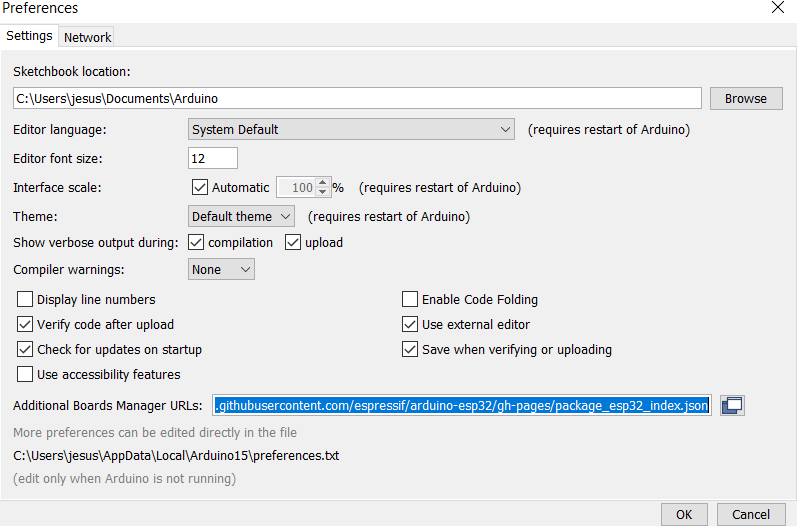
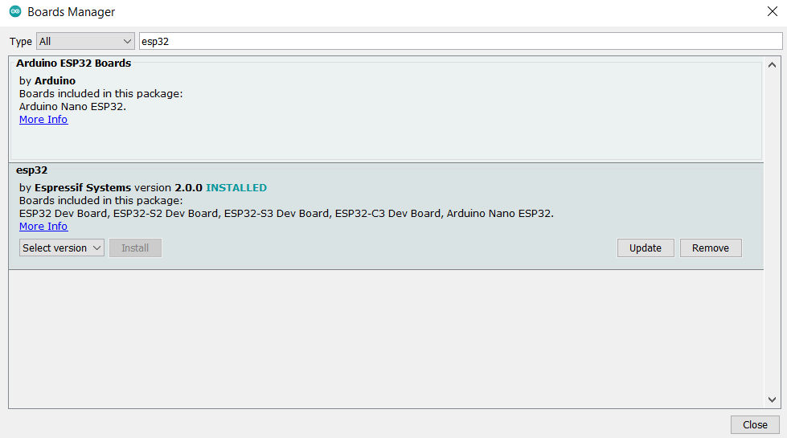

# DeepDeck Ahuyama - Arduino

DeepDeck is an open source 5x5 mechanical keyboard, using ESP32 microcontroller.

This repository contains a demo code and libraries to be used with DeepDeck Ahuyama hardware
in Arduino Framework.

You can get the board and more information at this link https://deepdeck.co

For complex features we recommend to use Espressif IDF version https://github.com/DeepSea-Developments/DeepDeck.Ahuyama.fw

## Folder content

├── ArduinoDeepDeck.ino        Main Arduino application
├── BoardPins.h                Pinout definition header
├── Definitions.h              Project definitions
├── KeyBoardLayout             Keyboard layout options
├── UI.h                       Menu definitions
├── DSD_Adafruit_APDS9960.zip  Adafruit Gesture sensor library modified
├── DSD_Adafruit_SSD1306.zip   Adafruit Display library modified
└── README.md                  This is the file you are currently reading

Here are the features:

## DeepDeck features

✅ - Implemented
🚧 - In process of improvement
📝 - In the roadmap
💬 - For feature releases/depending on the community votes

### Software Features

- ✅ Keypad 
  - ✅ scanning and press event detection
  - ✅ layer selection (letters, letters uppercase  and numbers)
- ✅ Knob
  - ✅rotation reading and button pressing  
- ✅ RGB LEDS
  - ✅ 3 keypad leds effects (Fadeing, Rainbow , Breathing)
- ✅ GUI demo 
  - ✅ menu navegation using display and knob.
- ✅ BLE keyboard 
  - keypad character sending
  - gesture left right sent as playback skip backward and  fordward
  - lef knob roation controls the volume playback
  - right top corner led indicates BLE connection status
- ✅ Gesture sensor
  - ✅ allows to sense left, right , up , down      

### Standard Libraries:
We use some libraries that you can find in arduino library manager or directly download using this links

- #include <BleKeyboard.h>https://github.com/T-vK/ESP32-BLE-Keyboard
- #include <Keypad.h> https://github.com/Chris--A/Keypad
- #include <Adafruit_GFX.h> https://github.com/adafruit/Adafruit-GFX-Library
- #include <ESP32Encoder.h> https://github.com/madhephaestus/ESP32Encoder/
- #include <FastLED.h> https://github.com/FastLED/FastLED

### Modified Libraries:

Install the  2 modified libraries that you can find inside of the repo folder as .zip files.

- DSD_Adafruit_APDS9960.zip
- DSD_Adafruit_SSD1306.zip

Both based on Adafruit libraries but modifed to resolve I2C sharings issues 
and thread safe.

We support all the same original features of the library.Here you can find the original Adafruit libraries and the version that we modifed.

- https://github.com/adafruit/Adafruit_APDS9960  version 1.2.3
- https://github.com/adafruit/Adafruit_SSD1306 version 2.5.7

### Arduino ESP32 core 

We use the core version 2.0.0 ,you can copy this link to Arduino preference 

https://raw.githubusercontent.com/espressif/arduino-esp32/gh-pages/package_esp32_index.json

